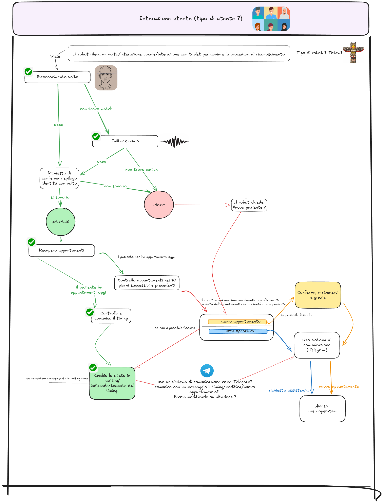

## Description

This project explores the use of robotics in healthcare to improve patient experience and streamline check-in procedures. It focuses on developing software for a robot that welcomes patients, assists with identification, and retrieves appointment data.

The system is designed as a modular pipeline combining perception, decision-making, and interaction components. Facial recognition is used as the primary identification method, generating identity predictions with confidence scores. When visual identification is uncertain or ambiguous, the system falls back to voice interaction, using Speech-to-Text to capture the patient's name.

The transcribed input is normalized and matched against a local database using similarity metrics (e.g., Levenshtein distance) to retrieve candidate identities. If multiple candidates are found, facial recognition is used again to disambiguate. Once the correct `patient_id` is determined, the system queries external healthcare APIs to retrieve appointments and patient data.

A decision engine then classifies the situation (e.g., on-time, late, or new patient) and determines the appropriate response. Interaction with the patient is handled through Speech-to-Text and Text-to-Speech modules, with optional support from Large Language Models to enhance dialogue quality.

---

## Operational Flow

1. The patient arrives at the system.  
2. Face recognition is attempted.  
3. If the face is recognized with high confidence, the corresponding `patient_id` is retrieved.  
4. If the face is not recognized or multiple candidates are detected, the system asks for the patient’s name and surname.  
5. The spoken input is transcribed into text.  
6. The text is normalized to a consistent format.  
7. The system searches the local database using a similarity metric (e.g., Levenshtein distance).  
8. One or more candidate patients are retrieved.  
9. If necessary, face recognition is used again to disambiguate between candidates.  
10. Once the correct `patient_id` is identified, an API call is made to retrieve the patient’s appointments.

